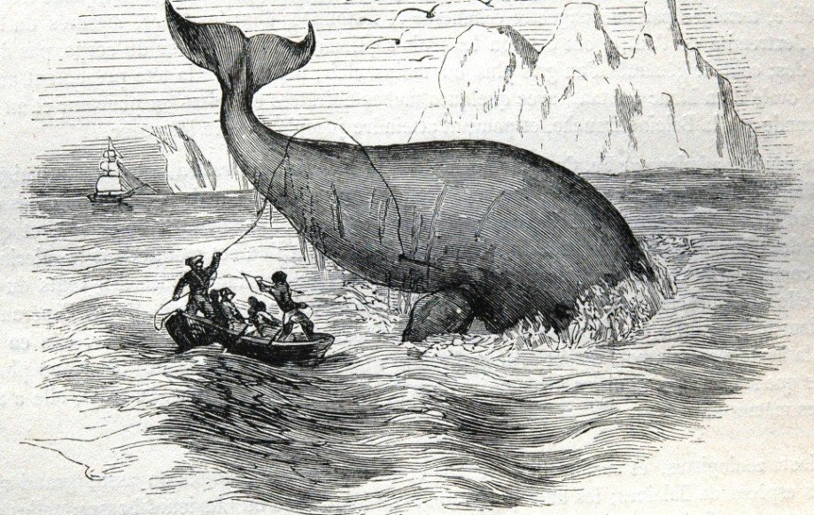

```{r setup, include=FALSE}
knitr::opts_chunk$set(echo = FALSE)
```

## I. Title of the article: 

Japan begins whaling after 30 years of peace



## II. Name of the Magazine + Source [URL]:

JapanForward : <http://japan-forward.com/untangling-the-myth-behind-the-whaling-controversy-a-directors-take/>

author: Megumi Sasaki


##  III. Vocabulary 

| Words from the text | Synonym/explanation in English |
| ------------------- | ------------------------------ |
|


## IV. Analysis table 

|                              |                                                                     |
| ---------------------------- | ------------------------------------------------------------------- |
| Researchers                  | / |
| Published in?                | 10/19/2019                                                       |
| General topic?               | whaling from the wiewpoint of the Japanese. the arguments favorable to hunting. |
| Conclusions/discovery?       |  The bale hunters are described as barbaric by westerners but they are not very different from other hunters or farmer. To say that whales are in danger is a fiction because most species are not threatened and whales hunted represent only a small percentage of the population.      |
| Remaining questions?         | (/) |

